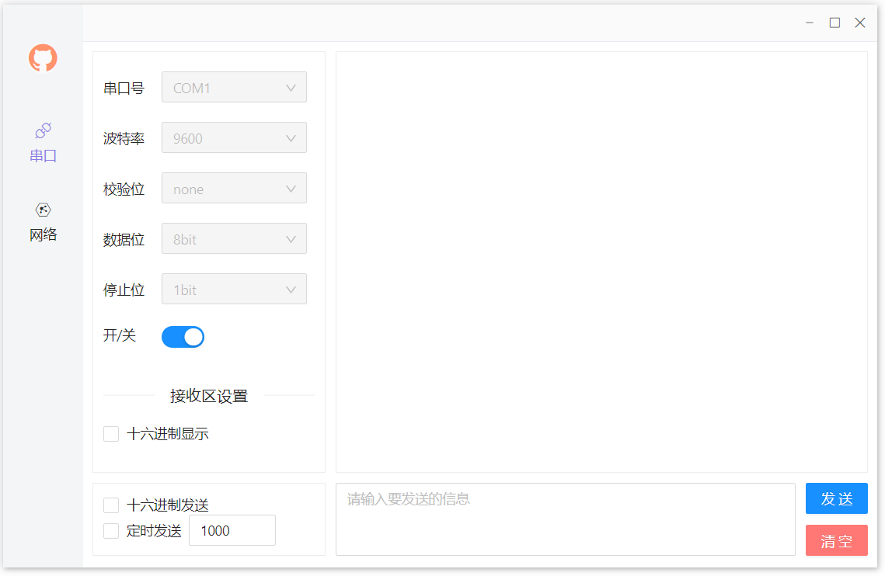
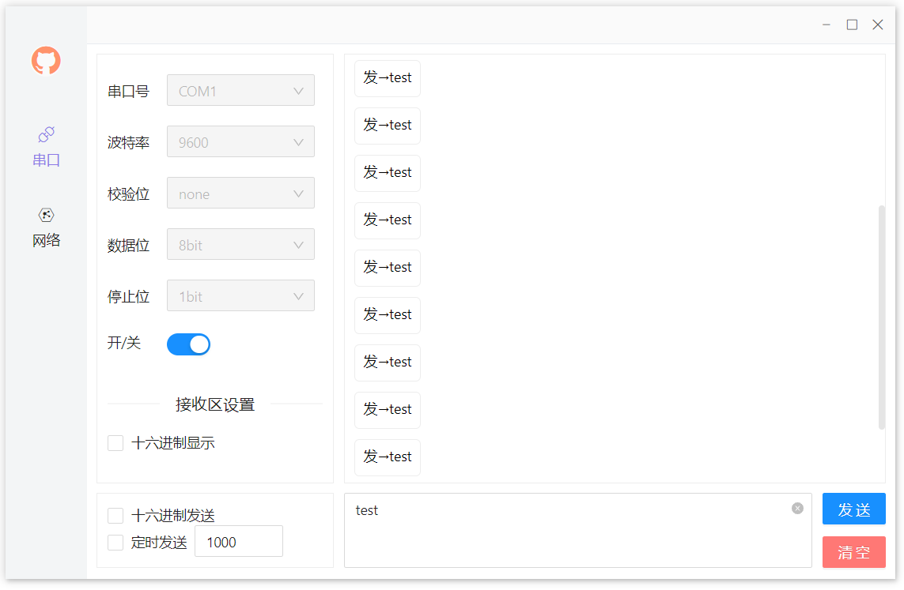

# 串口调试助手

> Electron + Vue + node-serialport + Ant Design 实现串口调试助手

## 功能

- [x] 串口通信
- [x] 16进制发送和显示
- [x] 自动刷新串口列表
- [x] 定时发送信息

## 下载&&运行

点击[下载链接](https://github.com/binkzhou/vue3_serial/releases)

## 界面预览

